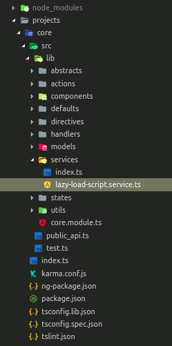
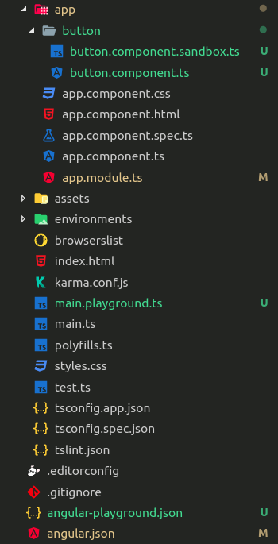
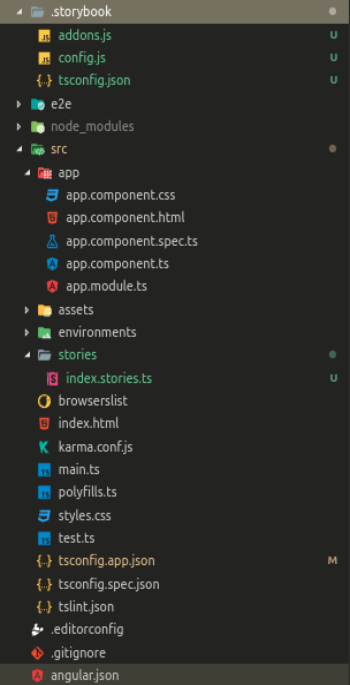
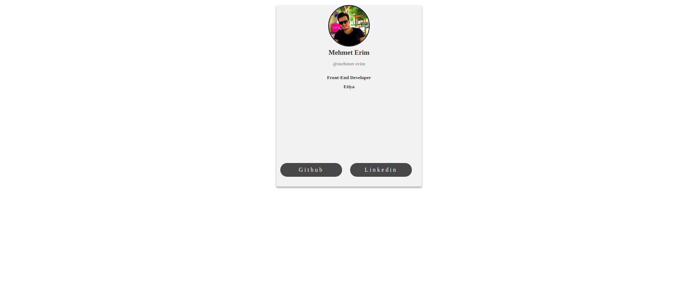
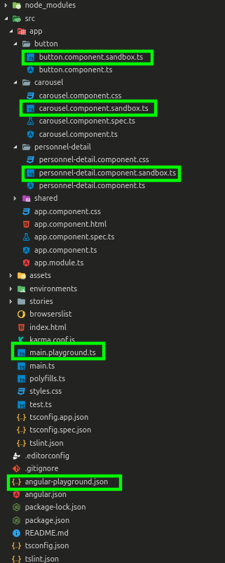
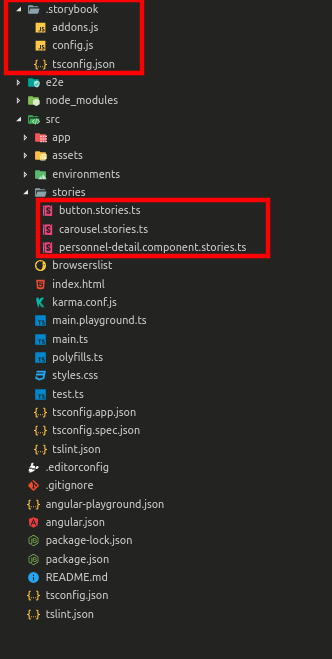

import { CodeSurfer } from "mdx-deck-code-surfer";
import { swiss as deckTheme } from "mdx-deck/themes";
import vsDarkPlus from "prism-react-renderer/themes/vsDarkPlus";
import duotoneLight from "prism-react-renderer/themes/duotoneLight";
import { Head, Appear, Image } from "mdx-deck";
import { SplitRight, Split } from "mdx-deck/layouts";

<Head>
	<title>Storybook & Angular Playground</title>
</Head>

export { components } from "mdx-deck-code-surfer";
export const theme = {
	...deckTheme,
	codeSurfer: {
		...vsDarkPlus,
		showNumbers: false,
	},
	css: {
		...deckTheme.css,
		".mpink": {
			color: "#ed6184",
		},
		".mgreen": {
			color: "#60c126",
		},
		".mred": {
			color: "#bb0000",
		},
		".munderline": {
			textDecorationLine: "underline",
		},
	},
};

<Image size="90%" src="./images/intro.png" />

---

<Image size="90%" src="./images/no-react.png" />

---

<Image size="90%" src="./images/storybook.png" />

---

# STORYBOOK NEDİR?

<ul>
	<Appear>
		<li>
			<h3>UI bileşenleri için proje ortamından izole bir sergi alanıdır.</h3>
		</li>
		<li>
			<h3>UI bileşenlerinin belirlenen senaryolarda gösterimini sağlar.</h3>
		</li>
	</Appear>
</ul>

---

<Image size="100%" src="./images/storybook.gif" />

---

# DAHA İYİSİ VAR

---

<Image size="90%" src="./images/playground.png" />

---

<Image size="100%" src="./images/playground.gif" />

---

# PEKİ NEDEN DAHA İYİ?

---

<Image size="70%" src="./images/storybook-warning.png" />

---

<Image size="80%" src="./images/storybook-scss.png" />

---

export default SplitRight;

	

<ul>
	<Appear>

this.lazyLoadService.loadScript("/assets/js/jquery.min.js")

 <code>Error: ENOENT: no such file or directory, stat   '/home/mehmet/Documents/projects/ngx-ui-kit/ node_modules/@storybook/core/dist/public   /assets/js/jquery.min.js'</code>

</Appear>
</ul>
---

<Image size="90%" src="./images/storybook-ts-error.png" />

---

export default Split;

	

---

# KURULUM

---

export default Split;

<ul>
	<h3 className="mgreen munderline">Angular Playground</h3>
	<Appear>
		<h3 className="mgreen">
			<code>ng add angular-playground</code>
		</h3>
		<h3 className="mgreen">
			<code>npm run playground</code>
		</h3>
	</Appear>
</ul>

<ul>
<h3 className="mpink munderline">Storybook</h3>
	<Appear>
		<h3 className="mpink"><code>npx -p @storybook/cli sb init --type angular</code></h3>
		<h3 className="mpink"><code>npm run storybook</code></h3>
	</Appear>
</ul>
---

export default Split;

	

	

---

<ul>
<h3 className="mgreen">
	<code>  ng generate angular-playground:sandbox button</code>
</h3>
	<Appear>
<h3 className="mgreen">
	<code>  ng generate angular-playground:sandbox button --flat</code>
</h3>
	</Appear>
</ul>
---

<CodeSurfer title="Button Component" code={require("!raw-loader!./snippets/c0.mdx")} steps={[{}]} />

---

<CodeSurfer
	title="Angular Playground"
	code={require("!raw-loader!./snippets/p1.mdx")}
	steps={[
		{ notes: "button.component.sandbox.ts  ⬇️" },
		{ range: [3, 6], notes: "button.component.sandbox.ts  ⬇️" },
		{ notes: "button.component.sandbox.ts  ➡️" },
	]}
/>

---

<CodeSurfer
	title="Storybook"
	code={require("!raw-loader!./snippets/1.mdx")}
	steps={[
		{ notes: "button.stories.ts  ⬇️" },
		{ range: [3, 6], notes: "button.stories.ts ⬇️" },
		{ notes: "button.stories.ts ➡️" },
	]}
/>

---

<Image size="90%" src="./images/r1.png" />

---

<Image size="90%" src="./images/rs1.png" />

---

<CodeSurfer
	title="Personnel Detail Component"
	code={require("!raw-loader!./snippets/c2.mdx")}
	steps={[
		{ notes: "⬇️" },
		{ range: [10, 13], notes: "@ngx-translate/core ⬇️" },
		{ range: [23, 28], notes: "⬇️" },
		{ notes: "➡️" },
	]}
/>

---

<CodeSurfer
	title="Angular Playground"
	code={require("!raw-loader!./snippets/p2.mdx")}
	steps={[
		{ notes: "personnel-detail.component.sandbox.ts ⬇️" },
		{ range: [3, 10], notes: "Mehmet Erim adlı senaryo ve template ⬇️" },
		{ range: [11, 20], notes: "Değişkenler ⬇️" },
		{ range: [2, 2], notes: "Hikaye bazlı import ⬇️" },
		{ notes: "personnel-detail.component.sandbox.ts ➡️" },
	]}
/>

---

<CodeSurfer
	title="Storybook"
	code={require("!raw-loader!./snippets/2.mdx")}
	steps={[
		{ notes: "personnel-detail.stories.ts ⬇️" },
		{ range: [6, 6], notes: "component ⬇️" },
		{ range: [7, 20], notes: "Değişkenler ⬇️" },
		{ range: [3, 5], notes: "Senaryo bazlı import ⬇️" },
		{
			notes: "Storybook componentinizin değişkenlerine direk atama yapabilir. ➡️",
		},
	]}
/>

---

---

<CodeSurfer
	title="Angular Playground"
	code={require("!raw-loader!./snippets/p3.mdx")}
	steps={[
		{ notes: "personnel-detail.component.sandbox.ts (list) ⬇️" },
		{ range: [26, 45], notes: "Değişkenler ⬇️" },
		{ range: [6, 26], notes: "Template ⬇️" },
		{ range: [19, 24], notes: "Component ⬇️" },
		{ range: [9, 12], notes: "NgModel tanımlayabilirsiniz ⬇️" },
		{ range: [29, 29], notes: "NgModel'e buradan bir referans değişken verebilirsiniz. ⬇️" },
		{ range: [0, 4], notes: "Hikaye bazlı import ⬇️" },
		{ range: [4, 4], notes: "Componentinizi declare etmek istiyor musunuz? ⬇️" },
		{ notes: "personnel-detail.component.sandbox.ts (list) ➡️" },
	]}
/>

---

<CodeSurfer
	title="Storybook"
	code={require("!raw-loader!./snippets/3.mdx")}
	steps={[
		{ notes: "personnel-detail.stories.ts (list) ⬇️" },
		{ range: [29, 48], notes: "Değişkenler ⬇️" },
		{ range: [6, 28], notes: "Template ⬇️" },
		{ range: [20, 25], notes: "Component ⬇️" },
		{ range: [10, 13], notes: "NgModel tanımlayabilirsiniz ⬇️" },
		{ range: [30, 30], notes: "NgModel'e buradan bir referans değişken verebilirsiniz. ⬇️" },
		{ range: [0, 4], notes: "Senaryo bazlı import ⬇️" },
		{ notes: "personnel-detail.stories.ts (list) ➡️" },
	]}
/>

---

<Image size="80%" src="./images/r3.gif" />

---

<CodeSurfer title="Carousel Component" code={require("!raw-loader!./snippets/c3.mdx")} steps={[{ notes: "➡️" }]} />

---

<CodeSurfer
	title="Angular Playground"
	code={require("!raw-loader!./snippets/p4.mdx")}
	steps={[
		{ notes: "carousel.component.sandbox.ts (card) ⬇️" },
		{ range: [8, 8], notes: "Projemizde var olmayan bir class ⬇️" },
		{ range: [13, 13], notes: "Projemizde var olmayan bir class daha ⬇️" },
		{ range: [20, 35], notes: "Style yazabiliriz ⬇️" },
		{ notes: "➡️" },
	]}
/>

---

<CodeSurfer
	title="Storybook"
	code={require("!raw-loader!./snippets/4.mdx")}
	steps={[
		{ notes: "carousel.component.sandbox.ts (card) ⬇️" },
		{ lines: [8, 13], notes: "Projemizde var olmayan classlar ⬇️" },
		{ range: [20, 36], notes: "Style template içine yazmak gerekiyor. ⬇️" },
		{ notes: "➡️" },
	]}
/>

---

<Image size="80%" src="./images/r3.gif" />

---

<CodeSurfer
	title="Angular Playground"
	code={require("!raw-loader!./snippets/p5.mdx")}
	steps={[{ notes: "Genel import ➡️" }]}
/>

---

<CodeSurfer
	title="Angular Playground"
	code={require("!raw-loader!./snippets/p5.1.mdx")}
	steps={[{ notes: "Hikaye bazlı import ➡️" }]}
/>

---

<CodeSurfer
	title="Storybook"
	code={require("!raw-loader!./snippets/5.mdx")}
	steps={[{ notes: "Senaryo bazlı import ➡️" }]}
/>

---

<ul>
	<h1 className="mred">Bir handikap daha</h1>
	<Appear>
		<h2>Storybook importları bir noktadan yönetemiyor.</h2>
	</Appear>
</ul>

---

# KLASÖR YAPISI

---

export default SplitRight;

	{" "}
	<h1 className="mgreen">Angular Playground</h1>{" "}

---

export default SplitRight;

	<h1 className="mpink">Storybook</h1>

---

	<h1>ÖZET</h1>

Angular Playground ve Storybook:
<ul>
	<li>Projenin UI rehberidir.</li>
	<li>Development hızını ve üretkenliğini artırır.</li>
	<li>
		Atomic Design için bir yapı taşıdır ve düşünebilme yeteneğini geliştirir.
	</li>
	<li>Projenizi farklı bir bakış açısıyla görmenizi sağlar.</li>
</ul>

---

<Image size="90%" src="./images/versus.png" />

---

